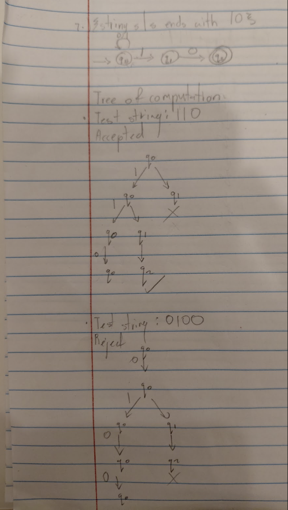
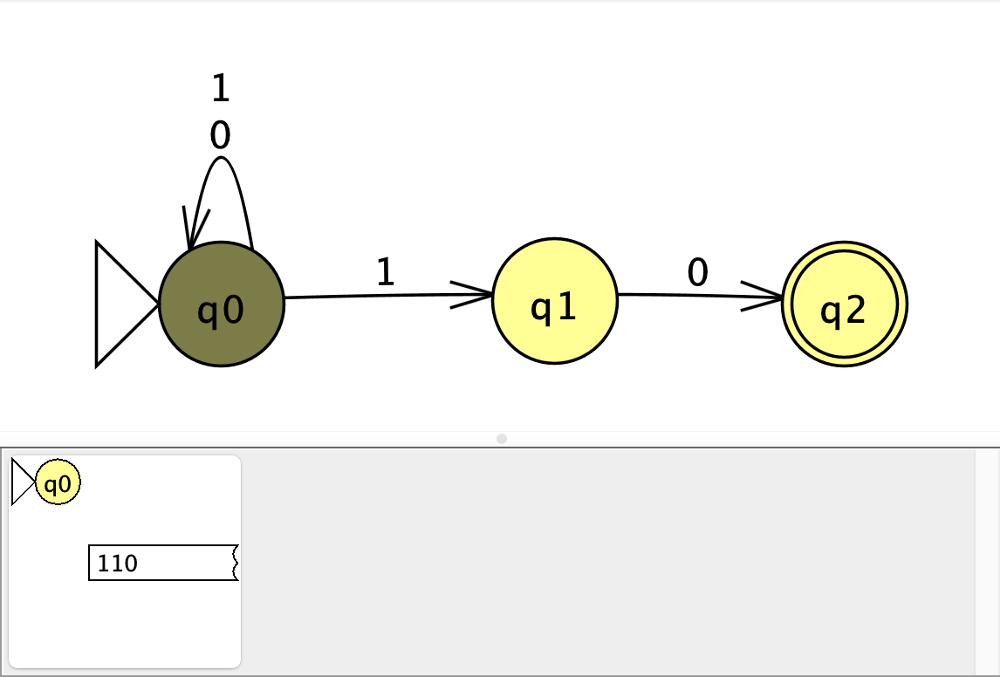
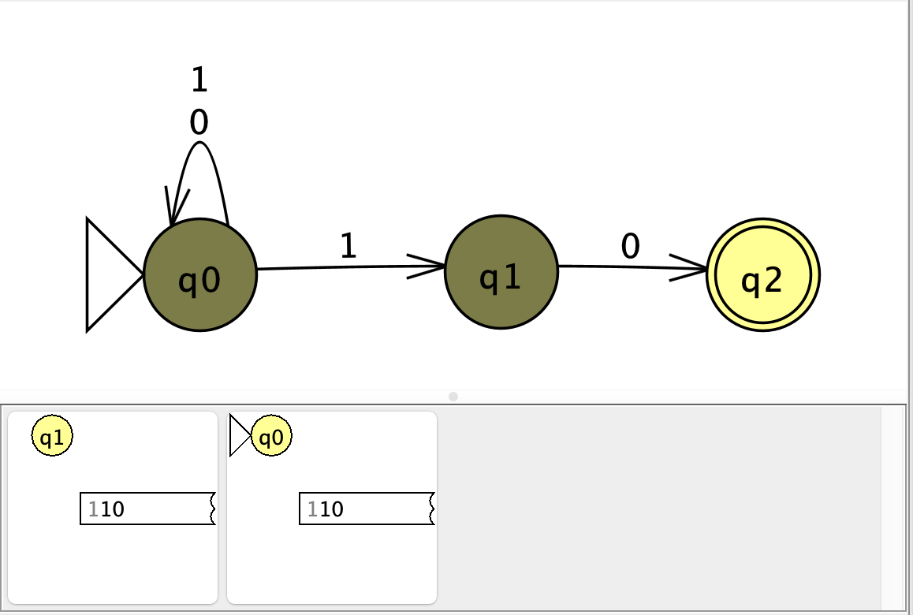
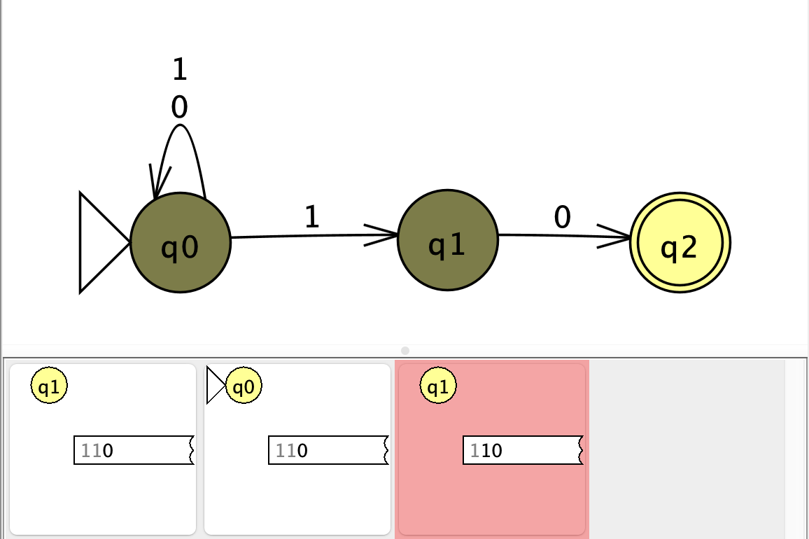
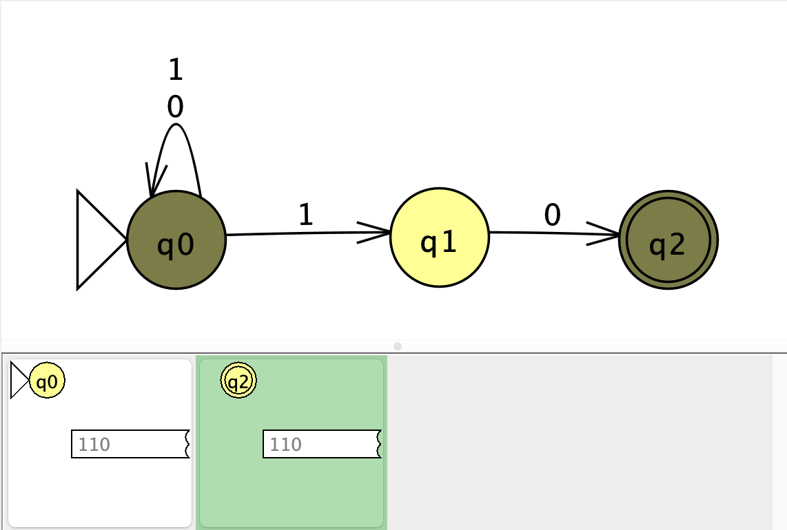
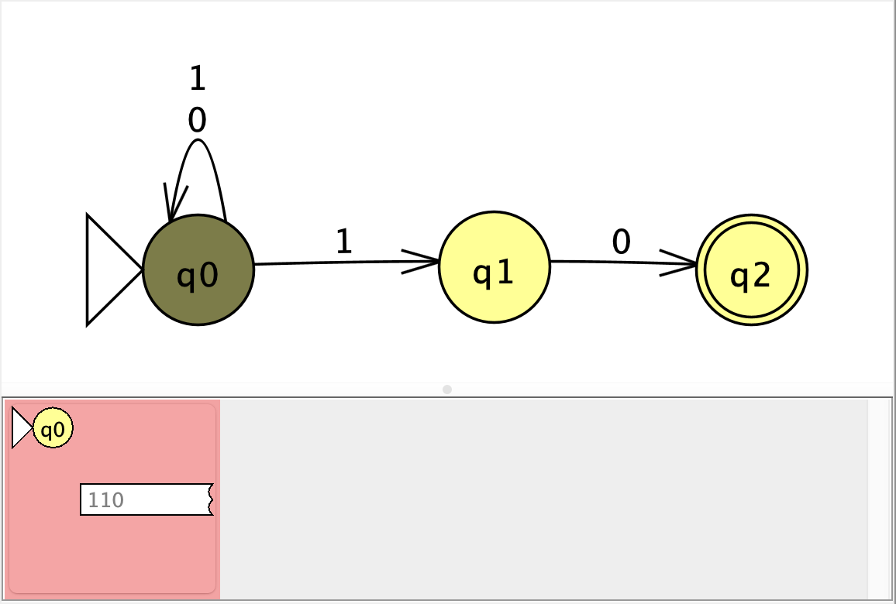
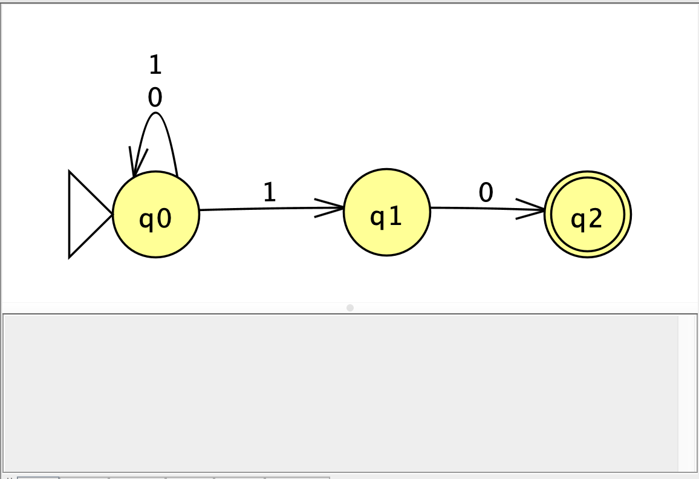

# NFA Diagram

*Figure 1. NFA diagram.*

# Batch Run: Test Strings

*Figure 2. JFLAP batch-run results.*

# Manual Tree of Computation

The hand-drawn computation tree traces an accepted string for the NFA.
Each branch shows the possible state after the next input symbol.

*Figure 3. Manual computation tree.*

# JFLAP Step-by-Step Transitions

The following screenshots show the same accepting computation in JFLAP.
They are ordered from the initial state through the final accepting state.

