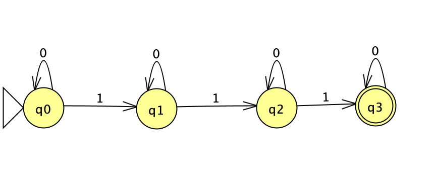
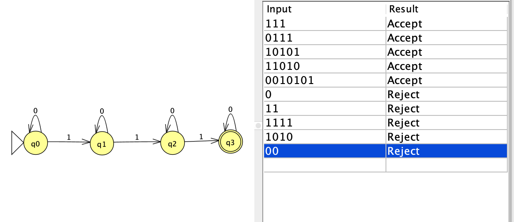

# NFA Diagram

The NFA accepts strings containing exactly three `1`s.

*Figure 1. NFA diagram.*

# Batch Run: Test Strings

The batch run shows five accepted strings followed by five rejected strings.

*Figure 2. JFLAP batch-run results.*