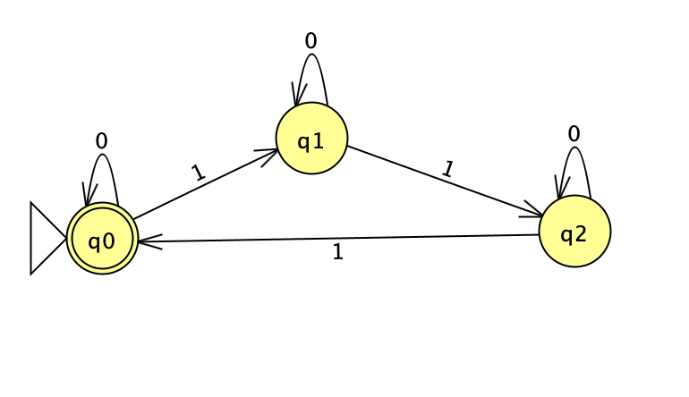
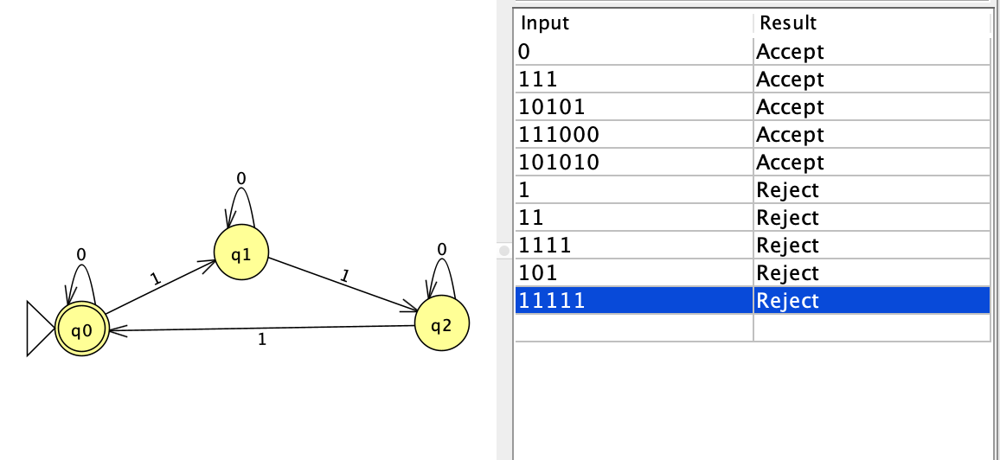

# NFA Diagram

The NFA accepts strings with a number of `1`s divisible by three.

*Figure 1. NFA diagram.*

# Batch Run: Test Strings

The batch run shows five accepted strings followed by five rejected strings.

*Figure 2. JFLAP batch-run results.*